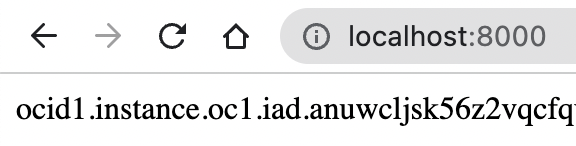
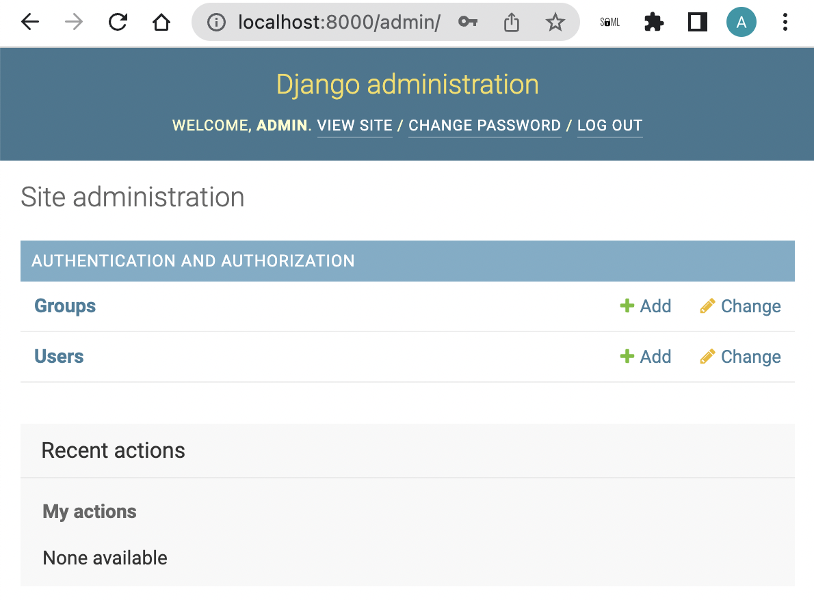

# Simple Django Web App - OCI Python SDK Sample

[](https://img.shields.io/badge/license-UPL-green) [](https://sonarcloud.io/dashboard?id=oracle-devrel_oci-sdk-java-samples)

## Introduction
Software Development Kits (SDKs) Build and deploy apps that integrate with Oracle Cloud Infrastructure services. Each SDK provides the tools you need to develop an app, including code samples and documentation to create, test, and troubleshoot. In addition, if you want to contribute to the development of the SDKs, they are all open source and available on GitHub.

This project sample helps developers to setup their first OCI SDK based python application.

## Cloning this Sample
```
git init python-django-app
cd python-django-app
git remote add origin https://github.com/oracle-devrel/oci-sdk-python-samples.git
git config core.sparsecheckout true
echo "hello-world/python-django-app/*">>.git/info/sparse-checkout
git pull --depth=1 origin main
cd hello-world/python-django-app/
```

## Installation

You need install the pre-requirements for run this example.

Update repositories of available packages to install, with the following command:

```
$ sudo apt update
```

Install necessary minimum dependencies, with the following command:

```
$ sudo apt install python3-dev python3-pip python3-virtualenv sqlitebrowser
```

For run this example need to install Django framework execute the follow command:

```
$ sudo pip install -r requirements.txt
```
And later followed by:

```
$ python3 manage.py migrate
```
At which point you should see:

```
Operations to perform:
  Apply all migrations: admin, auth, contenttypes, sessions, sites
Running migrations:

  Applying contenttypes.0001_initial... OK
  Applying auth.0001_initial... OK
  Applying admin.0001_initial... OK
  Applying admin.0002_logentry_remove_auto_add... OK
  Applying admin.0003_logentry_add_action_flag_choices... OK
  Applying contenttypes.0002_remove_content_type_name... OK
  Applying auth.0002_alter_permission_name_max_length... OK
  Applying auth.0003_alter_user_email_max_length... OK
  Applying auth.0004_alter_user_username_opts... OK
  Applying auth.0005_alter_user_last_login_null... OK
  Applying auth.0006_require_contenttypes_0002... OK
  Applying auth.0007_alter_validators_add_error_messages... OK
  Applying auth.0008_alter_user_username_max_length... OK
  Applying auth.0009_alter_user_last_name_max_length... OK
  Applying sessions.0001_initial... OK
  Applying sites.0001_initial... OK
  Applying sites.0002_alter_domain_unique... OK
```

For use the Django Admin Interface, it's needed to create a superuser for management, with the following command:

```
$ python3 manage.py createsuperuser --username admin --email admin@mail.com
```

At which point you should see:

```
Password:
Password (again):

Superuser created successfully.
```

## Run Application
After which you can run:

```
$ python3 manage.py runserver
```

Then, you can open the URL http://127.0.0.1:8000/ in your web browser and you can see the list of instances in your tenancy like this:


Also you can open in your web browser the URL http://127.0.0.1:8000/admin for access to the Django Admin Interface like this:


## References
* [Blog - Getting started with OCI Python SDK](https://blogs.oracle.com/linux/post/getting-started-with-the-oracle-cloud-infrastructure-python-sdk)
* [OCI SDK - Official Documentation](https://docs.oracle.com/en-us/iaas/Content/API/Concepts/sdks.htm)
* [OCI Python SDK - Open Source GitHub Repository](https://github.com/oracle/oci-python-sdk)

## Contributors
* Author: Ashok Raja CM
* Collaborators: NA
* Last Review: Aug 2022

## Contributing
This project is open source.  Please submit your contributions by forking this repository and submitting a pull request!  Oracle appreciates any contributions that are made by the open source community.

## License
Copyright (c) 2022 Oracle and/or its affiliates.

Licensed under the Universal Permissive License (UPL), Version 1.0.

See [LICENSE](../../LICENSE) for more details.

ORACLE AND ITS AFFILIATES DO NOT PROVIDE ANY WARRANTY WHATSOEVER, EXPRESS OR IMPLIED, FOR ANY SOFTWARE, MATERIAL OR CONTENT OF ANY KIND CONTAINED OR PRODUCED WITHIN THIS REPOSITORY, AND IN PARTICULAR SPECIFICALLY DISCLAIM ANY AND ALL IMPLIED WARRANTIES OF TITLE, NON-INFRINGEMENT, MERCHANTABILITY, AND FITNESS FOR A PARTICULAR PURPOSE.  FURTHERMORE, ORACLE AND ITS AFFILIATES DO NOT REPRESENT THAT ANY CUSTOMARY SECURITY REVIEW HAS BEEN PERFORMED WITH RESPECT TO ANY SOFTWARE, MATERIAL OR CONTENT CONTAINED OR PRODUCED WITHIN THIS REPOSITORY. IN ADDITION, AND WITHOUT LIMITING THE FOREGOING, THIRD PARTIES MAY HAVE POSTED SOFTWARE, MATERIAL OR CONTENT TO THIS REPOSITORY WITHOUT ANY REVIEW. USE AT YOUR OWN RISK. 